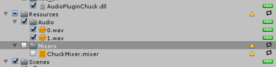
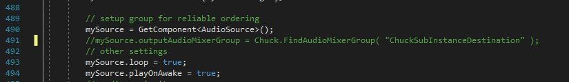

## Procedural audio models for video games with Chunity

> [Demo for the Audio Developer Conference (ADC), London, 18-20 November 2019.](https://adc19.sched.com/event/TSK2/demo-procedural-audio-models-for-video-games-with-chunity)

[Chunity](https://ccrma.stanford.edu/~lja/220c/chunity/) is a plugin for using the [ChucK](https://chuck.cs.princeton.edu/) programming language in the [Unity](https://unity.com/) game engine. This repository contains several procedural audio models of sound effects made in ChucK and implemented in Unity via Chunity.

Repository organisation:

> **ChucK Standalone**: Standalone version of the models.
>
> **Procedural Chunity**: Unity project with the implemented models.

## Using the standalone models
The standalone version of the models can be used directly in ChucK. The functionality of the models is equivalent to the ones implemented in Chunity, apart from the real-time control. *midiFan* uses MIDI as an example of controlling the models in real-time. 

## Using the Unity scene

    Unity version used: 2019.2.10f1

To use the Unity scene, the following two packages have to be downloaded to the project from the Unity Asset Store:

*  [Standard Assets](https://assetstore.unity.com/packages/essentials/asset-packs/standard-assets-for-unity-2017-3-32351) (version used: 1.1.5)
*  [Chunity](https://assetstore.unity.com/packages/tools/audio/chunity-chuck-for-unity-118383) (version used: 1.0.1)

After importing everything the project should run without problems. However, **to use the provided AudioMixer (which implements separate channels for each model and reverb)**, the following steps are required:

1. Do not import the Mixers folder from the Chunity plugin:

2. Comment out the following line (491) in ChuckSubInstance.cs (found in Assets/Chunity/Scripts). This bypass the default routing and allow to output each model different channels.

